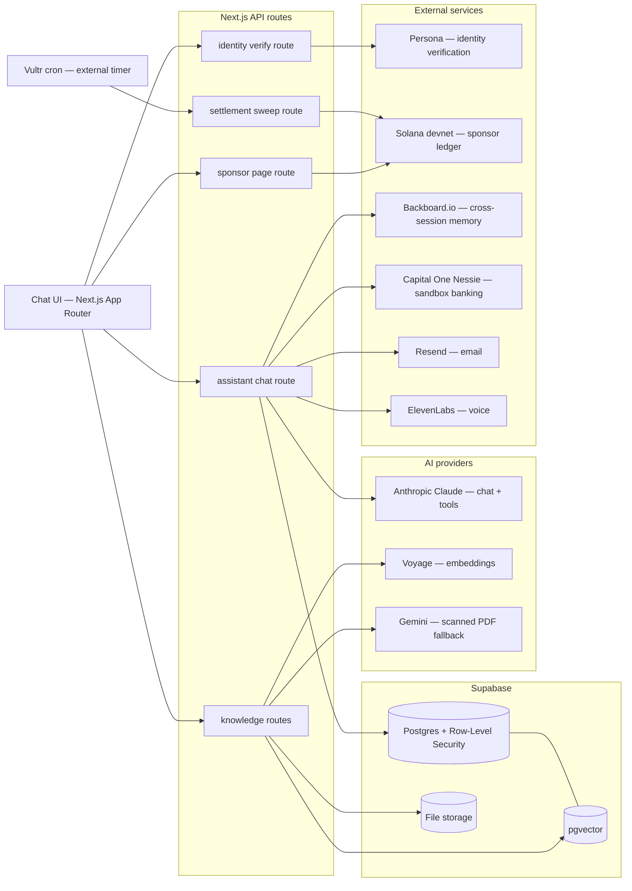
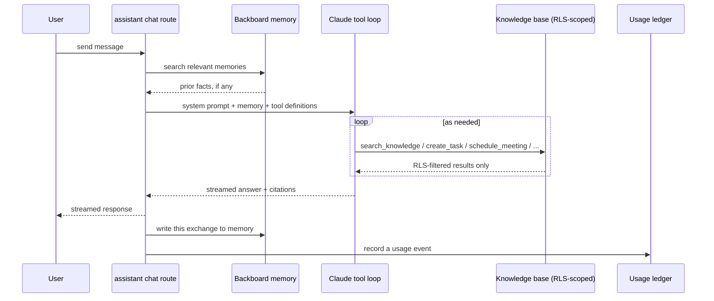
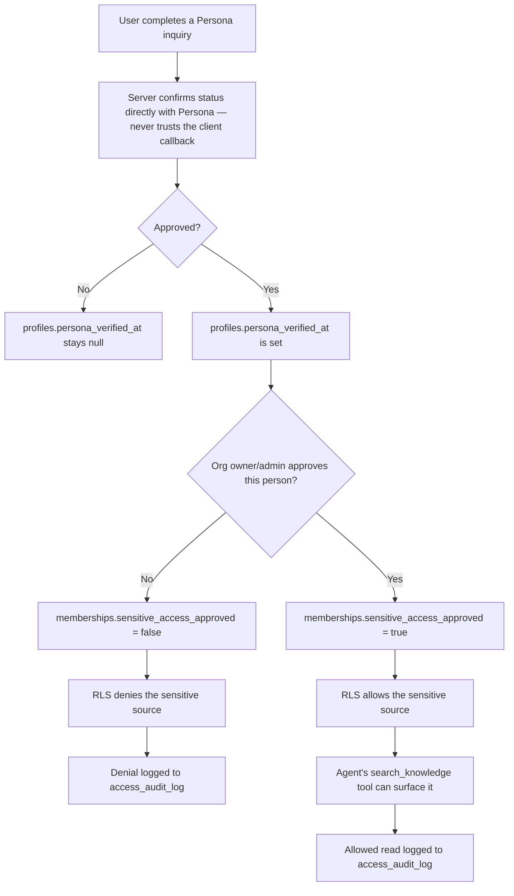
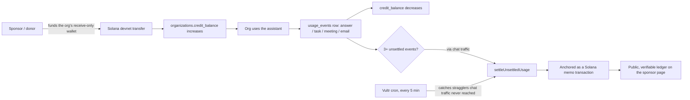
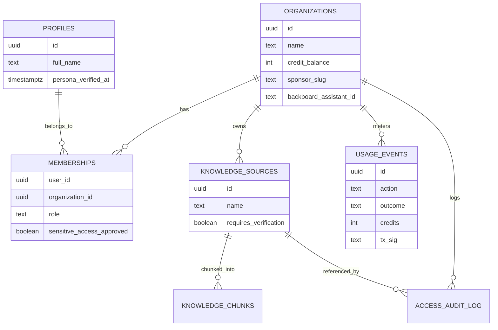

# iRABU

    

iRABU is an AI operating system for organizations that do more with less —
public schools, NGOs, nonprofits, farmer co-ops, and small teams without a
budget for a normal enterprise software stack. One chat interface, 30+
agentic tools, a knowledge base with cited answers, and a funding model built
so a donor can pay for the platform directly and transparently, without ever
seeing what anyone asked.

## Why

Most under-resourced organizations run on paper: weekly plans on a wall,
records in a stack nobody can search, technology donations nobody had the
capacity to actually use. iRABU replaces that with one place a team can ask
a question in plain language, get a sourced answer, and have the same
assistant act on it — and a way for a sponsor to fund that usage directly,
transparently, without a budget line the organization has to defend every
quarter.

## What's built

- **Multi-tenant auth** — Supabase Auth + Postgres RLS, one organization per
  workspace, owner/admin/member roles, invite-by-link, multi-workspace
  membership.
- **Knowledge platform** — upload `.txt` / `.md` / `.csv` / `.json` / `.pdf`,
  chunked and embedded with Voyage (`voyage-3.5`, 1024-dim), retrieved by
  cosine similarity scoped to your org. Scanned/image-only PDFs fall back to
  Gemini's multimodal reading when there's no text layer to extract.
- **Assistant chat** — Claude via the Vercel AI SDK's streaming tool-calling
  loop, 30+ tools spanning knowledge search with citations, tasks, meetings,
  email drafting, chart generation, data analysis, and finance workflows.
  Cross-session memory via Backboard.io; voice input/output via ElevenLabs.
- **Verified access** — an org's most sensitive knowledge sources can require
  Persona identity verification *and* a separate per-organization admin
  approval before the agent — or anyone — can read them, enforced in
  Postgres RLS underneath the tool itself. See
  [`docs/verified-access.md`](docs/verified-access.md).
- **Sponsored credits** — a donor funds an organization's usage directly on
  Solana; every answer/task/meeting/email is metered and settled on-chain as
  a public, verifiable, spend-restricted ledger. See
  [`docs/sponsored-credits.md`](docs/sponsored-credits.md).
- **Finance workflows** — a Capital One (Nessie) sandbox integration for
  paying vendors and recording received payments, with its own receipt
  ledger.
- **Team & Settings** — member list, invite links, workspace rename, identity
  verification, sensitive-access approval, and an explicit "assistant
  capabilities" panel.
- **Per-user daily rate limit** on the assistant, enforced in Postgres.

## Architecture

### System overview



### A single chat turn

Every message goes through memory recall, the tool-calling loop, and a
security boundary the model itself never touches — RLS decides what
`search_knowledge` can see, not a prompt instruction.



### Verified access — identity is not authorization

Two independent gates, both required, enforced in the database rather than
the prompt. See [`docs/verified-access.md`](docs/verified-access.md) for the
three real RLS bugs this design surfaced under live testing.



### Sponsored credits — funding on Solana



### Core data model



## Stack

- **Frontend/API:** Next.js 16 (App Router), TypeScript, Tailwind v4
- **Database/Auth:** Supabase — Postgres, pgvector, Row-Level Security, multi-tenant, multi-workspace
- **AI:** Anthropic Claude (chat + tool-calling), Voyage (embeddings), Gemini (scanned-PDF fallback)
- **Identity:** Persona (verification gating sensitive sources)
- **Blockchain:** Solana devnet (sponsored-credit settlement ledger)
- **Memory:** Backboard.io (cross-session chat memory)
- **Finance sandbox:** Capital One Nessie API
- **Comms:** Resend (email), ElevenLabs (voice)
- **Infra:** Vercel (hosting), Vultr (external settlement-sweep cron)
- **Charts:** Recharts, rendered from structured data the assistant produces

## Getting started

1. Create a **new** Supabase project (don't point this at an existing one —
   the schema is destructive-friendly and assumes it owns the database).
2. In the Supabase SQL editor, run `supabase/schema.sql` once.
3. In Supabase Auth settings, either disable "Confirm email" for the fastest
   local demo loop, or be ready to click the confirmation link after signup.
4. Copy `.env.example` to `.env.local` and fill in at minimum
   `NEXT_PUBLIC_SUPABASE_URL`, `NEXT_PUBLIC_SUPABASE_ANON_KEY`,
   `SUPABASE_SERVICE_ROLE_KEY`, and `ANTHROPIC_API_KEY` — every other key in
   `.env.example` is optional and degrades gracefully when absent (see the
   comment above each one for exactly what turns off without it).

```bash
npm install
npm run dev
```

Sign up (this creates your workspace), upload a document under Knowledge, then
ask about it under Assistant.

`supabase/migrations/` holds the same schema as numbered, incremental files;
`supabase/schema.sql` is those files concatenated into one script for
standing up a fresh project in a single run.

## Credits

iRABU's feature set and design share underlying ideas with the author's
earlier products, **getirabu.com** (marketing site) and **irabu.ai** (the
permission-aware chat app) — same author, same lineage of thinking, but this
is a separate, from-scratch codebase, not a copy of either repository's
source.
